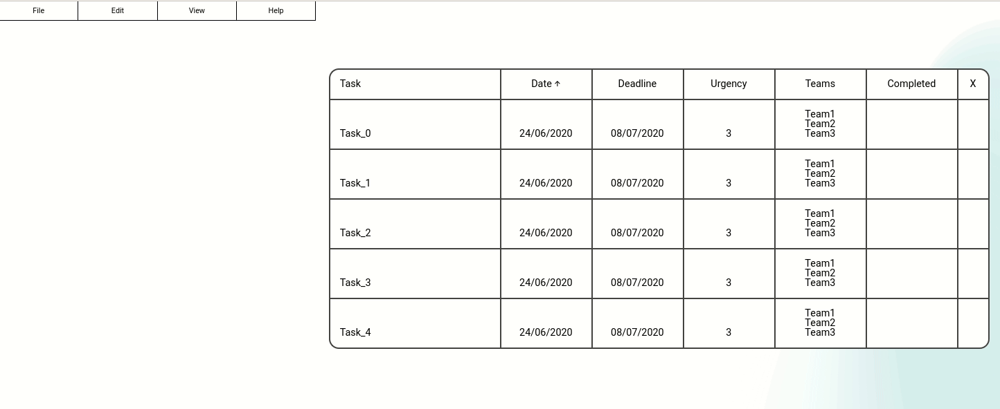

<h3>Project Management Platform</h3>

PMP is a platform for managing task lists for projects.

<h3>Usage</h3>
<h3>Deleting Entries</h3>

Entries can be deleted via the following method:

  <ol>
    <li>Select the entries to delete by clicking and dragging over them</li>
    <li>Click <code>Edit</code> in the top left navigation menu</li>
    <li>Hover over <code>Delete</code></li>
    <li>Click <code>Delete Selected</code></li>
  </ol>

<h3>Filtering Entries</h3>

The task list can be filtered for entries that meet a specific set of criterion.

Open the filter via the following method:

  <ol>
    <li>Click on <code>View</code> in the top left navigation menu</li>
    <li>Hover over <code>Taskbars</code></li>
    <li>Click <code>Show Filter</code></li>
  </ol>

Next for this example we filter for tasks that are highly urgent (above 4 in urgency) and involve only the 2 main teams (Team 1 & Team 2) via the following method:

  <ol>
    <li>Select the <code>Active</code> checkbox</li>
    <li>Set <code>Urgency Range</code> to minimum <code>4</code></li>
    <li>For the <code>Teams</code> dropdown, select <code>Team 1</code> & <code>Team 2</code></li>
    <li>Set <code>Match Type</code> to <code>AND</code></li>
  </ol>

<h4>Batching New Tasks</h4>

Multiple tasks can be added to the database by using a single template.

Templates can be very quickly written using strings, although it will likely be much easier to intially use the wizard to generate the correct template string.

To open the wizard for a template input, click the ⚡ button next to the corresponding form.

The syntax of the templating is listed below:

<h4>Task Template Syntax</h4>

<code>${n/l, #, a/d}</code>

  Where: 
  <ul>
    <li><code>n</code> is number, <code>l</code> is letter</li>
    <li><code>#</code> is number of digits, (skipped for letter)</li>
    <li><code>a</code> is ascending, <code>d</code> is descending</li>
  </ul>

Examples:
    <ul>
    <li><code>BackendTest_${n}</code> with 4 tasks would output: <code>[BackendTest_1, BackendTest_2, BackendTest_3, BackendTest_4]</code></li>
    <li><code>FrontendTest_${n-1,3}</code> with 3 tasks would output: <code>[FrontendTest_000, FrontendTest_001, FrontendTest_002]</code></li>
    <li><code>feature_${l,d}</code> with 5 tasks would output: <code>[feature_z, feature_y, feature_x, feature_w, feature_v]</code></li>
  </ul>

<h4>Date/Deadline Template Syntax</h4>

<code>${#/#/#} +/- # n d/w/m/y</code>

  Where: 
  <ul>
    <li><code>${#/#/#}</code> is the date/month/year (use <code>t</code> instead of a number for today's date/month/year)</li>
    <li><code><code>+</code> or <code>-</code></code> is whether the date modification is added or subtracted</li>
    <li><code>#</code> is the date modification multiplier</li>
    <li><code>n</code> is the task number index (leave out for static modification)</li>
    <li><code>d/w/m/y</code> is the unit of the modification (day, week, month or year)</li>
  </ul>

Note:

<blockquote><code>${t}</code> is shorthand for <code>${t/t/t}</code>, today's date.</blockquote>
<blockquote>Multiple modifications can be applied to one date (i.e. <code>${t} + nd + 5y - w</code>)</blockquote>

Examples:
  <ul>
    <li><code>${1/1/2020}+2nd</code> with 5 tasks would output: <code>[1/1/2020, 1/3/2020, 1/5/2020, 1/7/2020, 1/9/2020]</code></li>
    <li><code>${31/10/2020}+5y</code> with 3 tasks would output: <code>[31/10/2025, 31/10/2025, 31/10/2025]</code></li>
    <li><code>${24/2/2020}-2nw</code> with 5 tasks would output: <code>[24/2/2020, 10/2/2020, 27/1/2020, 13/1/2020, 30/12/2019]</code></li>
    <li><code>${10/5/2021}-3nm+ny</code> with 4 tasks would output: <code>[10/5/2021, 10/2/2022, 10/11/2022, 10/8/2023]</code></li>
  </ul>

<h3>To Do</h3>

Authentification is not yet implemented. Once implemented the manager account will be able to view the complete task list and assign tasks to individual teams. A team account will only be able to view the tasks assigned to them and tick them off as they are completed.

